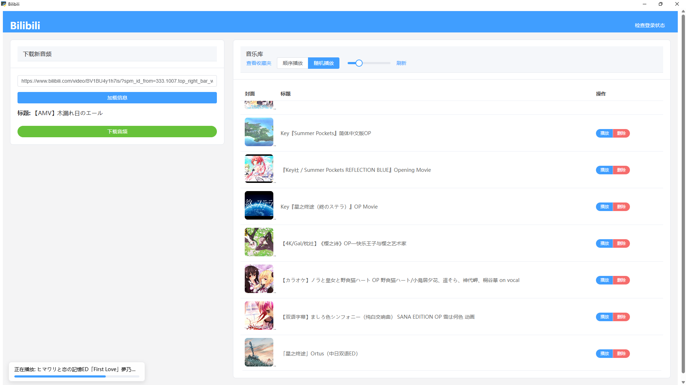
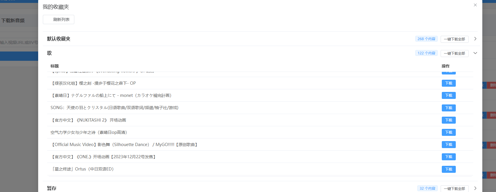

# Bilibili Music

这是一个基于 `pywebview` 和 `Vue.js` 构建的桌面应用程序，用于下载B站视频的音频，并管理本地音乐库。

## ✨ 功能特性

- **B站视频音频下载**: 输入视频URL或BV号，即可下载对应的音频。
- **封面与信息**: 元信息使用视频封面和标题信息。
- **在线播放**:
    - **播放/暂停**: 直接在应用内播放音乐。
    - **播放模式**: 支持顺序播放和随机播放两种模式。
    - **音量调节**: 可调节播放音量。
- **登录B站账号**:
    - **二维码登录**: 通过扫描二维码进行登录。
    - **收藏夹下载**: 可以下载B站收藏夹中的音频。
- **删除文件**: 可以方便地从音乐库中删除指定的音频文件。


<p align="center">
    
    
</p>


## 🛠️ 技术栈

- **前端**: Vue.js 3 + Element Plus
- **后端**: Python + Flask
- **桌面GUI**: pywebview

## 🚀 使用说明

### 1. 从源代码运行

```bash
# 安装 Python 依赖
pip install -r requirements.txt

# 安装前端依赖并构建
cd frontend
npm install
npm run build
cd ..

# 启动应用
python main.py
```

### 2. 打包为可执行文件

本项目使用 `PyInstaller` 进行打包。

```bash
# 安装 PyInstaller
pip install pyinstaller

# 执行打包命令
pyinstaller --name BilibiliMusic --windowed --onefile --add-data "frontend/dist;frontend/dist" main.py
```

打包成功后，您可以在生成的 `dist` 目录下找到 `BilibiliMusic.exe` 可执行文件。

> **注意**:
> 1. 运行过程中产生的用户会话信息（包括敏感信息 cookies）会保存在 `data/sessions` 目录下，请妥善保管。
> 2. 本项目结构简单且不规范，主要用于学习和个人使用。

## 📚 参考

- Bilibili API 集合: [SocialSisterYi/bilibili-API-collect](https://github.com/SocialSisterYi/bilibili-API-collect)
- pywebview: [r0x0r/pywebview](https://github.com/r0x0r/pywebview)